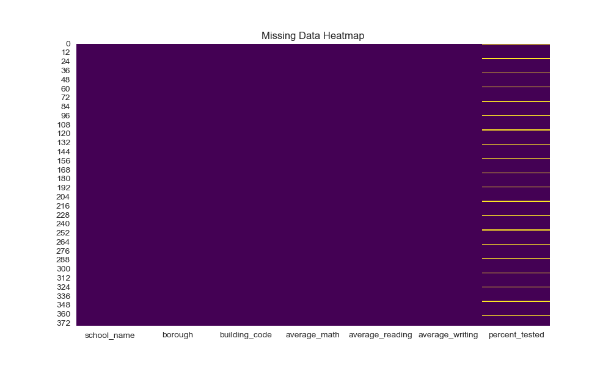
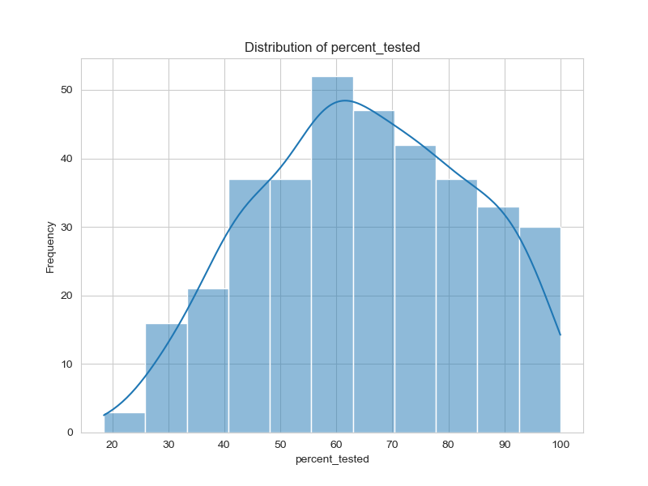
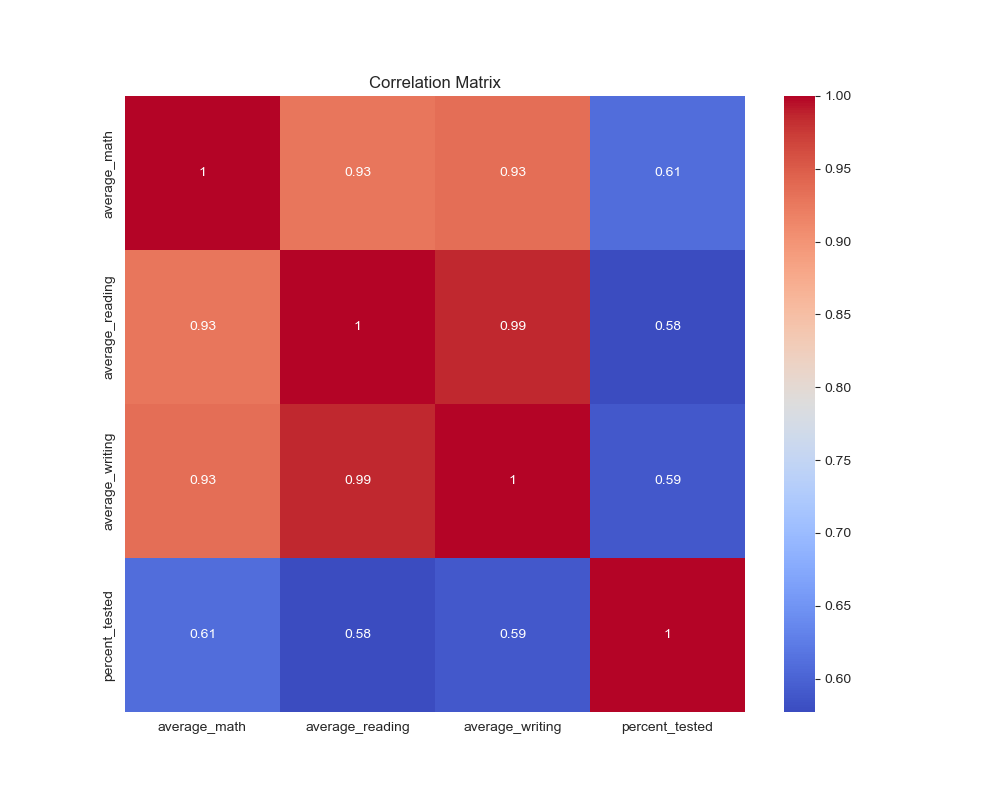

# 🏫 Exploring NYC Public School Test Scores (EDA)

## 📜 Overview
This project focuses on exploratory data analysis (EDA) of NYC public school datasets to uncover insights about student performance and other school-related metrics. It aims to identify trends, highlight key performance indicators (KPIs), and provide actionable insights for stakeholders.

## 🛠️ **Key Skills and Tools**
- **Python**: Pandas, Seaborn, Matplotlib
- **Data Analysis**: Exploratory Data Analysis (EDA), trend visualization, KPI extraction
- **Data Visualization**: Distribution plots, scatter plots, heatmaps, bar charts

## 🔑 **Highlights**
- **Distribution Analysis**: Visualized distributions of numeric variables to identify trends and outliers.
- **Borough Comparisons**: Compared performance metrics (e.g., attendance rate, test scores) across boroughs.
- **KPI Extraction**: 
  - Average attendance and graduation rates.
  - Correlation between attendance and graduation rates.
  - Top-performing schools based on test scores.
- **Correlation Insights**: Heatmap of relationships between numeric variables.

## 🗂️ **Data Description**
- **Dataset**: NYC public school data with columns for demographics, academic performance, and location-based information.
- **Key Features**:
  - Numeric variables like attendance rate, graduation rate, and test scores.
  - Categorical variables like borough and school name.
- **Missing Data Handling**: Visualized and analyzed null values for data quality assessment.

## 🧰 **Steps in the Analysis**
1. **Data Loading and Cleaning**:
   - Loaded the dataset and inspected for missing values.
   - Visualized missing data using heatmaps.
2. **Exploratory Data Analysis**:
   - Plotted distributions for all numeric columns.
   - Examined borough-wise averages for numeric variables.
3. **KPI Analysis**:
   - Identified top-performing schools based on test scores.
   - Explored correlations between numeric variables.
4. **Visualization**:
   - Used scatter plots, bar charts, and heatmaps to present findings effectively.
  
## 📈 Summary of Findings
- Numeric distributions and trends were visualized to identify outliers and patterns.
- Borough-level analysis highlighted variations in performance across regions.
- A positive correlation was observed between attendance rate and graduation rate, emphasizing the importance of attendance in academic success.
- The top 10 schools were identified based on test scores, showcasing excellent performance.
- Key relationships between variables were explored using a correlation matrix.

## 📂 **Repository Contents**
- `EDA_NYC-School.ipynb`: The complete Jupyter Notebook with analysis and visualizations.
- `schools.csv`: The dataset used in this analysis.
- `plots/`: Directory containing generated visualizations.
- `README.md`: Documentation of the project.

## Visualizations

### 1. Missing Data Heatmap

### 2. Distribution of test Score

### 4. Correlation Matrix

