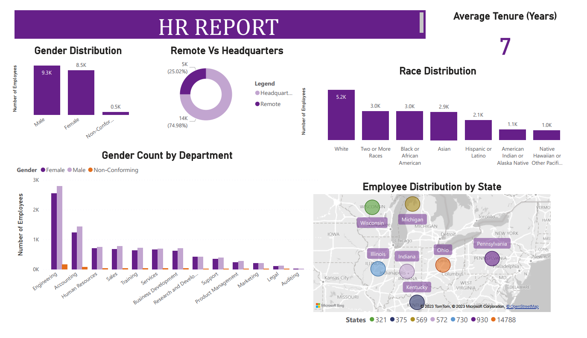
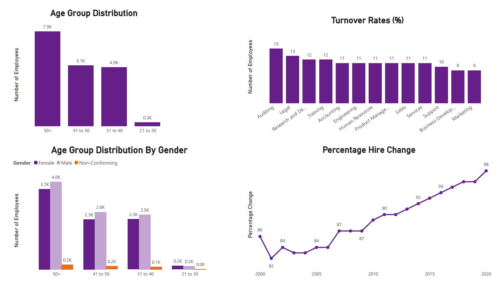

# 📊 HR DATA ANALYSIS – SQL Server & Power BI

This project is a comprehensive HR analytics case study that combines **SQL Server 2022** and **Power BI** to analyze and visualize Human Resource data. The dashboard and analysis are designed to provide actionable insights on workforce diversity, employee turnover, hiring trends, and organizational structure.

---

## 📌 Project Summary

- **Goal:** Provide HR teams with insightful metrics to improve decision-making and workforce planning.
- **Tools Used:** SQL Server 2022, Power BI Desktop
- **Data Size:** 22,000 employee records from 2000 to 2020
- **Techniques:** Data cleaning in SQL, calculated columns, visual storytelling, KPI tracking

---

## 🗂 Source Data

The dataset consists of HR records covering:
- Personal details (age, gender, race, birthdate)
- Employment details (hire date, termination date, job title, department)
- Location information (state, remote vs HQ)

> The raw dataset (`hr_data.csv`) is included in the repository.

---

## 🧹 Data Cleaning & Preparation (SQL Server)

Data cleaning was performed in SQL Server and includes:
- Handling `NULL` values
- Standardizing date formats
- Creating calculated columns (e.g., age, tenure)
- Categorizing data for visual analysis

---

## 🔍 Exploratory Data Analysis

Key questions addressed:
1. What is the age distribution in the company?
2. How is gender distributed overall and by department?
3. What’s the racial composition of the workforce?
4. Which departments have the highest turnover?
5. How are employees distributed by state?
6. What are the most common job titles?
7. How have hiring patterns changed over time?

> SQL scripts for answering these questions are included in the repo.

---

## 📊 Power BI Dashboard

An interactive dashboard was created using Power BI. Visuals include:
- Gender, age, and race breakdown
- Remote vs HQ employees
- State-wise employee distribution (Map)
- Department-level turnover
- Hiring trends (2000–2020)

📌 Average Employee Tenure: **7 years**  
📌 Remote Employees: **~25%**  
📌 Most Populated State: **Ohio (14,788 employees)**  
📌 Highest Turnover: **Auditing Department**

> 📁 Files:
- `hr_report.pbix` – Power BI file
- `hr_report.pdf` – Dashboard preview
- `SQL_scripts.sql` – All data cleaning and EDA queries

---

## 🛠 Skills Demonstrated

- Advanced SQL queries (joins, aggregations, subqueries)
- Data cleaning & feature engineering
- DAX measures in Power BI
- Dashboard design & layout
- Business KPIs & HR analytics
- Trend & cohort analysis

---

## 🧠 Why This Project Matters

This project reflects a real-world BI use case where raw HR data is cleaned, analyzed, and visualized to support business objectives. It demonstrates the power of integrating SQL and Power BI for impactful data storytelling, which is essential in HR analytics, reporting, and strategic planning.

---

## 📸 Dashboard Preview

