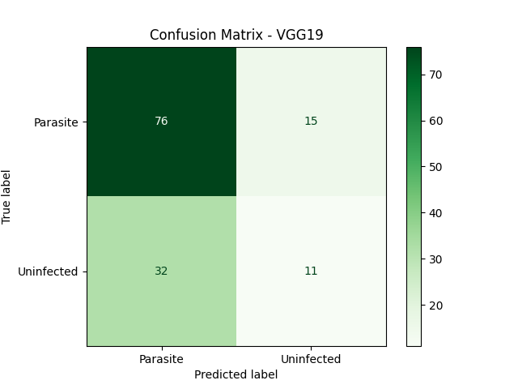
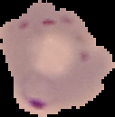
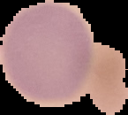

# 🦠 Malaria Detection Using CNN & Transfer Learning

This project focuses on detecting malaria-infected cells from microscopy images using two deep learning approaches:

1. 🧠 A custom Convolutional Neural Network (CNN)
2. 🔁 Transfer Learning using the VGG19 model pretrained on ImageNet

---

## 📁 Dataset

- **Source**: [NIH Malaria Dataset on Kaggle](https://www.kaggle.com/datasets/iarunava/cell-images-for-detecting-malaria)
- 27,000+ labeled images of parasitized and uninfected cells.

---

## 🎯 Objectives

- Detect malaria in red blood cell images using deep learning.
- Compare performance of custom CNN vs. VGG19 transfer learning.
- Use data augmentation to boost generalization.

---

## 🧪 Model Architectures

### ✅ Custom CNN
- 3 convolutional layers + max pooling
- Dropout regularization
- Fully connected dense layers

### ✅ VGG19 (Transfer Learning)
- Pretrained on ImageNet
- Top layers fine-tuned for malaria detection

---

## 📈 Model Performance

### 🔬Validation Accuracy Comparison Custom CNN & VGG19 (Transfer Learning)

---

## 📊 Confusion Matrix (VGG19)

---

## 🖼️ Sample Predictions

| Image | True Label | Prediction |
|-------|------------|------------|
|  | Parasitized | Parasitized |
|  | Uninfected | Uninfected |
| ... | ... | ... |

---

## 🧠 Technologies Used

- Python, TensorFlow / Keras
- Matplotlib, Scikit-learn
- Google Colab
- CNN, Transfer Learning

---

